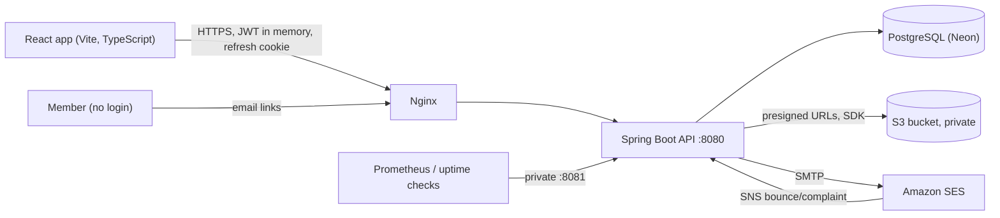

# Architecture

Amanah Connect is a multi-tenant community-management API: a **modular monolith** (one Spring Boot process, one PostgreSQL database)
organised by feature, with the tenant boundary enforced in the database layer, the repository layer and the web layer.

## Runtime pieces

| Piece | What it does | Notes |
|---|---|---|
| Spring Boot API | Everything under `/api/v1` | Stateless; any number of instances behind Nginx |
| PostgreSQL (Neon) | All data | App uses the **pooled** endpoint, Flyway the **direct** one |
| S3 | Logos, attachments, receipt/bill PDFs, data-export ZIPs | Private bucket; browsers get short presigned URLs |
| SES (SMTP) | All email | Sent by a worker from the **outbox table**, never from a request thread |
| Scheduled jobs | Overdue marking, recurring invoices, reminders, subscription expiry, outbox sender, data exports, announcement publishing | `@Scheduled` + ShedLock (one instance runs each job) |
| Management port 8081 | `/actuator/health`, `info`, `prometheus` | Never published or proxied |

## Package layout (`com.amanahconnect`)

`auth` (login, JWT, refresh rotation, 2FA, lockout, rate limits) · `tenant` (tenant context, filter, repositories base) ·
`community` (profile, settings, admin API, CSV import) · `plan` · `member` · `billing` (fee plans, invoices, payments, receipts, UPI QR, pay links) ·
`ledger` · `report` · `complaint` · `support` · `announcement` · `mail` (templates, outbox sender, SES webhook, suppression) · `file` (S3, usage) ·
`reminder` · `audit` (writer, read side, CSV export) · `dashboard` · `dataexport` · `lead` · `publicapi` (token-based public endpoints) ·
`observability` (metrics, log context, health) · `config` · `common` (errors, money, paging, CSV, web filters).

Dependencies point inward: controllers call services, services call repositories and query classes. Architecture tests
(`ArchitectureTest`, checked against deliberately bad fixtures by `ArchitectureRulesSelfTest`) fail the build when a controller touches a repository,
an entity is returned from an API, a tenant repository gets an unscoped read, or a mutating endpoint has no audit rule.

## A request, end to end

1. **Nginx** terminates TLS and forwards (`X-Forwarded-*` honoured: `server.forward-headers-strategy=native`).
2. `RequestIdFilter` assigns/echoes `X-Request-Id` and puts it in the log context. `RequestSizeLimitFilter` refuses oversized JSON bodies (413).
3. **Spring Security** (deny by default): bearer JWT → `MfaSetupEnforcementFilter` → `AdminAccountFilter` (is the account still active?) →
   `TenantContextFilter` (community from the *principal*, never from input; writes refused for suspended communities) → `LogContextFilter`
   (hashed user, community id into every log line).
4. **Controller** → DTO validation → **service** (`@Transactional`) → repositories. Hibernate's tenant filter is a second net under the explicit
   `communityId` parameters.
5. Mutations write an **audit row in the same transaction** (`@Audited` aspect or an explicit `AuditService.record`).
6. Errors become RFC 9457 `application/problem+json` with a stable `code` (`GlobalExceptionHandler`).

## Data rules that shape the code

* Tenant tables have `community_id`; composite foreign keys `(id, community_id)` stop cross-community references. Cross-tenant access answers **404**,
  identical to "does not exist" (see `docs/tenancy.md`).
* Money: `numeric(14,2)` / `BigDecimal` / string in JSON. Never floating point.
* Financial rows are never deleted: payments and ledger entries are corrected by **reversal rows**; numbers (invoice, receipt) are gap-free per
  community and financial year (`document_counters`).
* `audit_logs` is append-only (triggers refuse UPDATE/DELETE). It holds ids and counts, never names or emails.
* Members have no login. Everything reaches them by email: bills, receipts, reminders, announcements. Payment happens from a tokenised public page.
* Schema changes only through new Flyway migrations; `ddl-auto=validate`.
* Right to erasure anonymises personal fields but keeps every financial record (`docs/read-side.md`).

## Email path

Request thread writes `email_outbox` rows (inside the business transaction) → `EmailOutboxJob` (every 30 s) claims a batch with `FOR UPDATE SKIP LOCKED`
→ renders Thymeleaf templates → SMTP to SES → marks `SENT`, retries with exponential back-off (6 attempts), or `FAILED`. Mail with secrets in its payload
(reset and invite links, export links) has the payload erased as soon as it is sent. SES bounces and complaints arrive on a signed SNS webhook and
feed `email_suppressions`.

## Consistency and concurrency

* Optimistic locking (`version`) on invoices and payments; an `expectedVersion` from the client turns a stale view into 409.
* Idempotency keys on payment recording (same key + same request = the stored result, same key + different request = 409).
* Advisory locks serialise "one data export at a time per community" and number allocation.
* Jobs are idempotent: re-running one finds nothing left to do (`last_generated_period`, `invoice_reminders` unique rows, outbox leases).

## What is deliberately not here

No message broker, no cache cluster (one 30-second in-memory Caffeine cache for the dashboard), no background-worker service. At the target scale
(hundreds of communities, tens of thousands of members) one database and a couple of API instances are enough; the outbox, ShedLock and the stateless
design are the seams where a queue or a separate worker could be added later.
