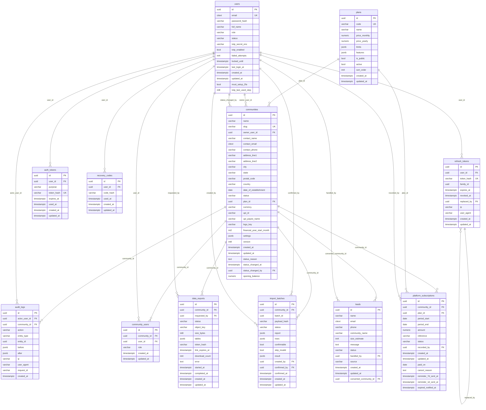
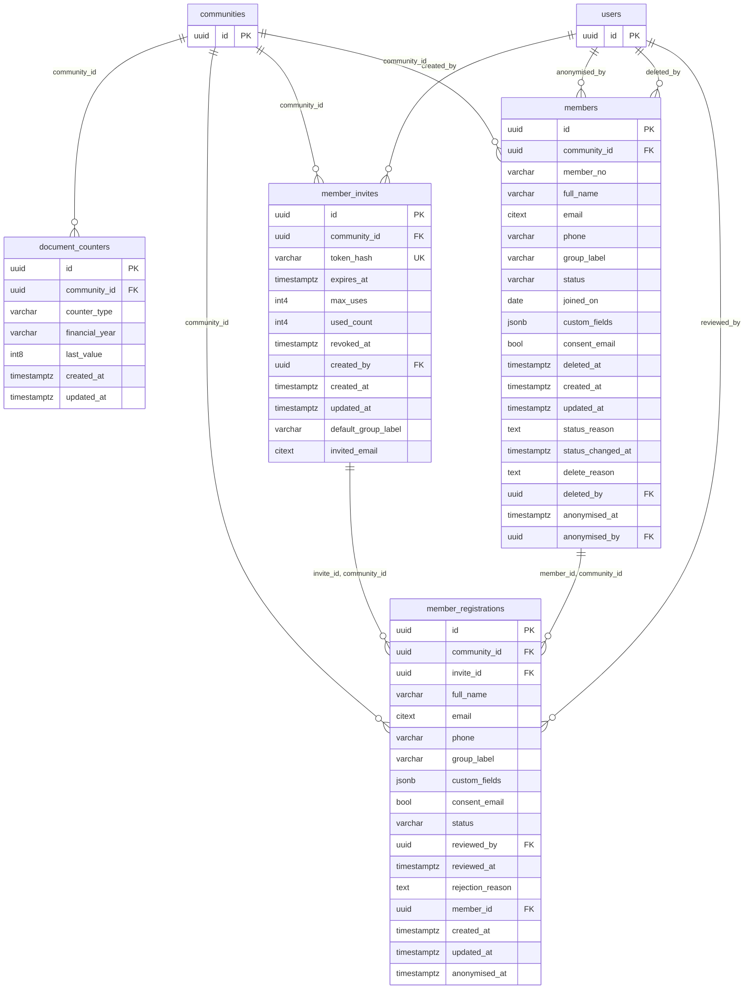
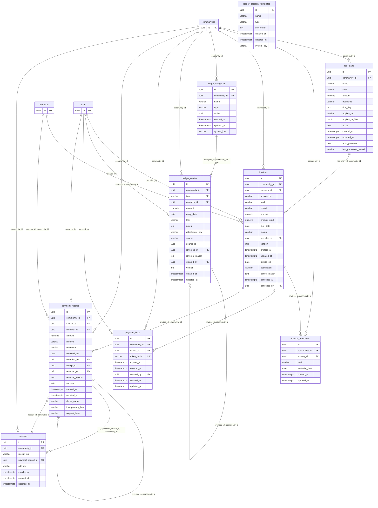
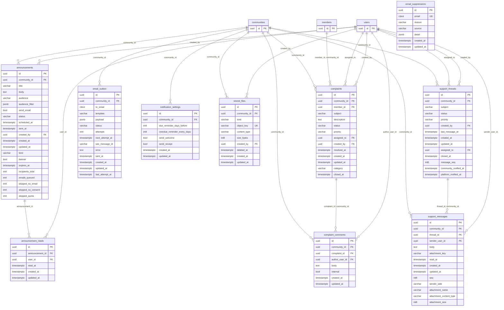

# Data model

Generated from the migrated PostgreSQL schema by `DataModelDocIT`; do not edit by hand. To regenerate after a migration:

```
./mvnw verify -Dit.test=DataModelDocIT -DargLine="-Dgenerate.docs=true"
```

Every tenant table carries `community_id`; composite foreign keys `(id, community_id)` make it impossible for a row to point at another community's row. Money is `numeric(14,2)`. Financial rows are never deleted (reversal rows instead). `audit_logs` is append-only (database triggers).

## Identity, plans and platform



## Members



## Billing and ledger



## Communication and files



## Indexes and constraints

See the migrations in `backend/src/main/resources/db/migration`; they are the source of truth. `SchemaMigrationIT` and `ConstraintsIT` check that the tables exist and that the constraints reject bad data.
